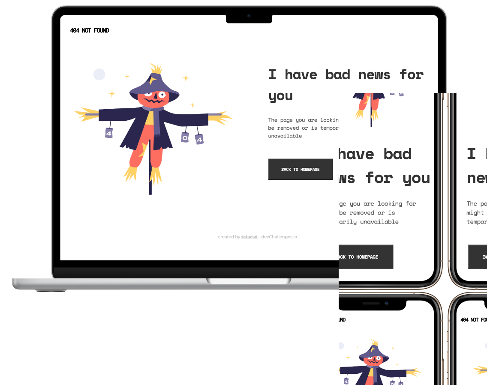

<!-- Please update value in the {}  -->

<h1 align="center">404 Not Found</h1>

   Solution for a challenge from  <a href="https://devchallenges.io/solutions/V4if68jXzkR7iHLdOH2z" target="_blank">Devchallenges.io</a>.

  <h3>
    <a href="https://tatacsd.github.io/devchallenge-404-not-found/">
      Demo
    </a>
     | 
    <a href="https://github.com/tatacsd/devchallenge-404-not-found/blob/master/index.html">
      Solution
    </a>
     | 
    <a href="https://devchallenges.io/challenges/wBunSb7FPrIepJZAg0sY">
      Challenge
    </a>
  </h3>

<!-- TABLE OF CONTENTS -->

## Table of Contents

- [Overview](#overview)
  - [Built With](#built-with)
- [Contact](#contact)

<!-- OVERVIEW -->

## Overview

 
 
  

This application/site was created as a submission to a [DevChallenges](https://devchallenges.io/challenges) challenge. The [challenge](https://devchallenges.io/challenges/wBunSb7FPrIepJZAg0sY) was to Create a 404 not found page following the design. The page should be responsive. Don’t look at the existing solution. Fulfill user stories below:

User story: I can see a page following the given design

You can see my demo [here](https://tatacsd.github.io/devchallenge-404-not-found/)

### Built With

<!-- This section should list any major frameworks that you built your project using. Here are a few examples.-->

- [css](https://developer.mozilla.org/en-US/docs/Web/CSS)
- [html](https://developer.mozilla.org/en-US/docs/Web/HTML)
- [javascript](https://developer.mozilla.org/en-US/docs/Web/JavaScript)

## Contact

- GitHub [@your-username](https://github.com/tatacsd)
- Twitter [@your-twitter](https://twitter.com/thayscasado)
